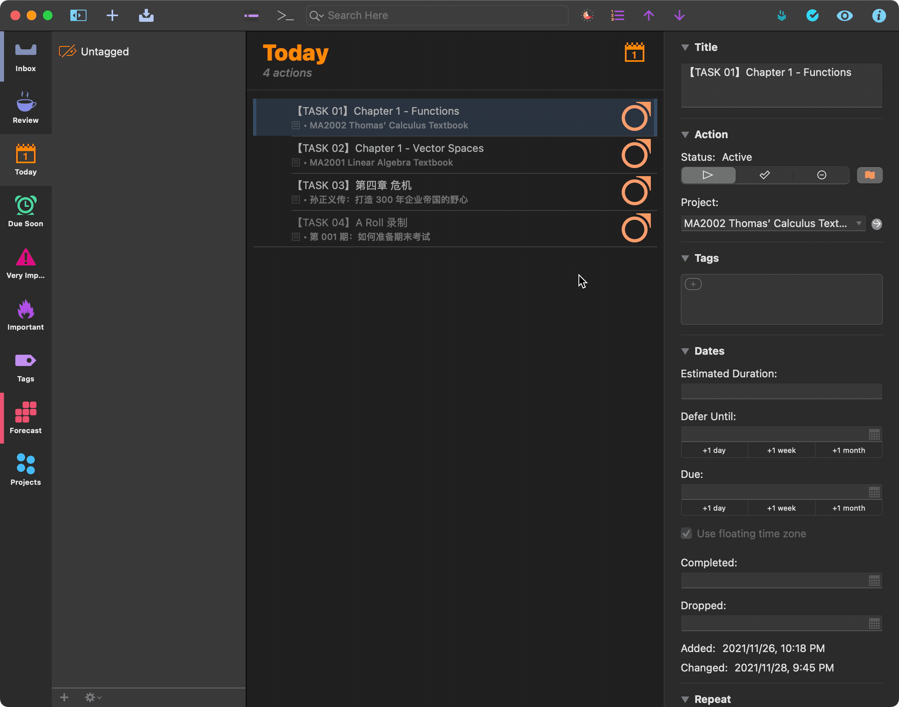

# OmniFocus Today

I created this project because [OmniFocus](https://www.omnigroup.com/omnifocus/) does not have a true today perspective. Note that you have to have an OmniFocus Pro in order to use this plugin, because it takes advantage of the custom perspective and automation features that comes with the Pro version of OmniFocus. 

In creating this plugin, I hope that there would be a perspective where you can:

1. Show everything that you've flagged
2. Show everything that is due soon
3. Order everything that is in this perspective

I am also a [Session](https://www.stayinsession.com/) user, so I also included in this library a script to launch a Session using the Session URL Scheme. 

## Set Up

Download the omnifocusjs bundle from the releases tab, right click, and select "open with OmniFocus."

After installing this plugin, you will need to set up a "Today" perspective like the following one:


## Usage

Everything that you flagged will be placed in the "Today" perspective.

Everything in the "Today" perspective will be numbered, with the following format:

```
【Task 01】xxxxxxx
【Task 02】xxxxxxx
【Task 03】xxxxxxx
【Task 04】xxxxxxx
```

You can drag the 4 icons into the top bar:


The first one would launch the task in Session (If you don't use session, you can ignore this);

The second one would attach a number to every task (you generally won't need this, but just in case when the numbering got messed up, you can click this to force reordering)

The third one: once you select an item, you can move it up;

The forth one: once you select an task, you can move it down.



